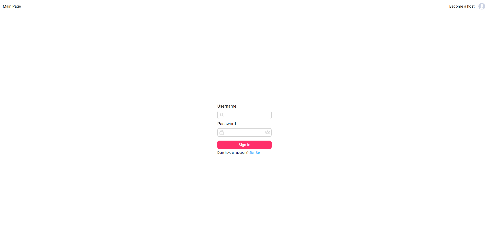
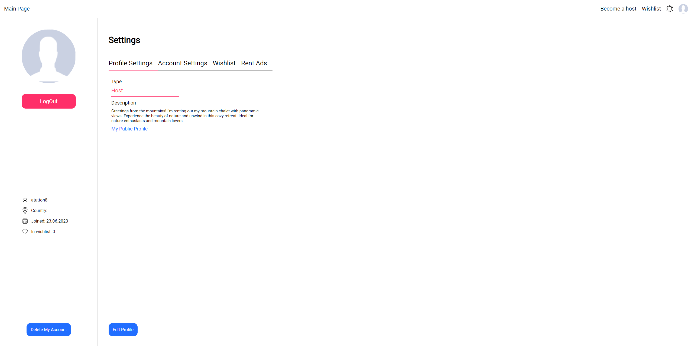
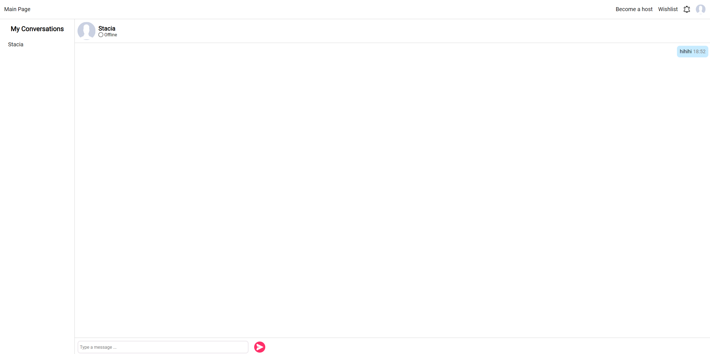
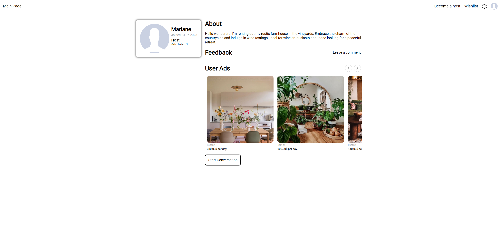
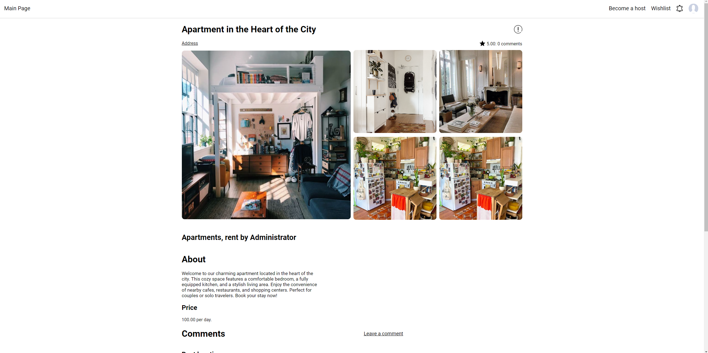

# Booking Platform

## Description

The booking platform is a web application that server as a platform for renting and booking various types of properties, such as apartments, houses, rooms, and more. It enables users to find, list and add ads, they are also able to interact with each other through messaging and leaving comments.

### Key Features:

1. User Registration and Authentication:
   - Users can create accounts adn log in to the platform using their username and password.
2. Messaging System:
   - Users can communicate with eaqch other through chats, enabling them to ask questions and clarify details.
3. Feedback:
   - Users can comment ads or user profiles, leave rewiews and ratings, helping future users make informed decisions.
   - You can also complain to an ad if there is something wrong with it.
4. Wishlists: 
   - Users can add ads to a wishlist to access them easy.
5. Public profiles:
   - Each user have a public profile, with his ads, self-description and users feedback.
6. Admin dashboard:
   - Admin have access to a special page '/complains', where he can manage user complains to ads.

## Pages

### Login Page



### Main Page


### User Profile



### Conversations Page 



### Public Profile



### Ad page



You can test other functions by yourself.

There are 28 ads and 10 users profiles in database. Here are their nicknames:
  - administrator
  - smethringham2
  - mlared3
  - cdrew4
  - scansfield5
  - mbrewett6
  - whindrich7
  - atutton8
  - dclemmens9
  - mstycha
  
Password to enter is 'password'.
## Project Dependencies

### Frontend:

+ @googlemaps/js-api-loader: This package provides a simple way to load the Google Maps JavaScript API asynchronously.
+ axios: Axios is a popular HTTP client library used for making HTTP requests from the frontend to the backend or external APIs.
+ cropperjs: CropperJS is an image cropping library that allows users to select and crop images on the frontend.
+ sass: Sass is a popular CSS preprocessor that enables the use of variables, nested rules, and more, making CSS code more maintainable.
+ socket.io-client: This package provides the client-side implementation of Socket.IO, enabling real-time communication between the client and server over WebSocket.
+ vue: Vue.js is a progressive JavaScript framework for building user interfaces. It allows for building reactive and dynamic components on the frontend.
+ vue-router: Vue Router is the official router for Vue.js applications. It enables navigation between different views in a Vue app.
+ webpack: Webpack is a powerful module bundler that allows developers to bundle and manage frontend assets like JavaScript, CSS, and images.
### Backend:

+ bcryptjs: BcryptJS is a library used for hashing passwords securely, commonly used in user authentication systems.
+ connect-flash: This middleware allows the storage of temporary messages (e.g., flash messages) in the session to be displayed on the next page rendered.
+ cookie-parser: Cookie parser is a middleware that parses HTTP request cookies into a JavaScript object for easy access.
+ debug: Debug is a utility library that provides debugging functionality, often used to log debug messages during development.
+ ejs: EJS (Embedded JavaScript) is a templating engine that allows the embedding of JavaScript code within HTML templates for dynamic content generation.
+ express: Express is a popular web application framework for Node.js, providing a set of features for building web applications and APIs.
+ express-session: This middleware enables the use of sessions in Express applications, allowing storage of user data across multiple requests.
+ ioredis: Ioredis is a Redis client for Node.js, enabling communication with Redis, which is an in-memory data store often used for caching and data storage.
+ morgan: Morgan is a middleware used for logging HTTP requests in Express applications.
+ passport: Passport is an authentication middleware for Node.js, providing a flexible and modular way to handle user authentication strategies.
+ passport-local: Passport strategy for authenticating with a username and password, commonly used for local authentication in applications.
+ passport.socketio: Passport Socket.IO is an integration of Passport authentication with Socket.IO, enabling authentication in real-time applications.
+ pg: Pg (PostgreSQL) is a PostgreSQL database client for Node.js, allowing interaction with PostgreSQL databases in the backend.

## Installation guide

1. Clone repository.
   ```bash
   git clone https://github.com/OveRLorD132/booking
2. Go to directory and install dependencies.
   ```bash
   cd booking
   npm install
3. Import the database backup into your Postgres database.
4. Start the Redis server by running redis-server.exe.
5. Run project.
   ```bash
   cd /path/to/repository
   node app.js
6. Open your web browser and go to https://localhost:3000/ to access the application.

To run your project using Docker with the image already uploaded to Docker Hub, follow these steps:

1. Install Docker: Ensure you have Docker installed on your system. You can download and install Docker Desktop from the official website for your respective operating system.
2. Run the Project: Open a terminal or command prompt, navigate to the project directory (where docker-compose.yml is  located), and run the following command: 
  ```bash
  docker-compose up
